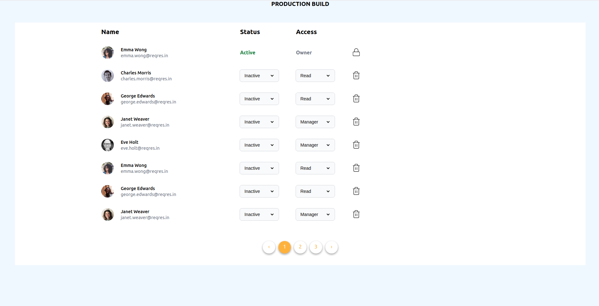
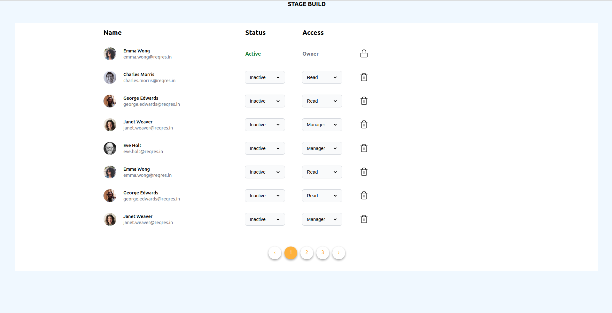
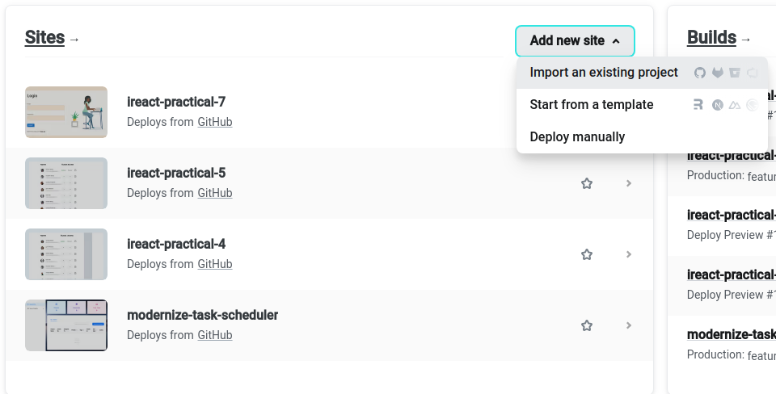
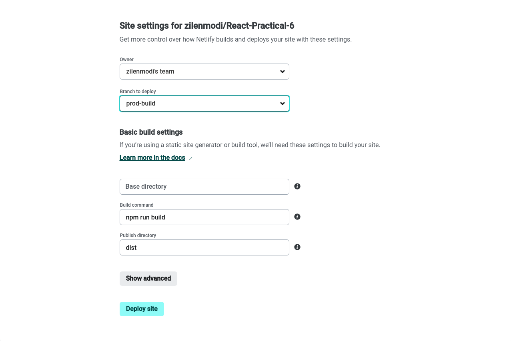

# React-Practical-6

### Deployment Links

```jsx
https://react-practical-6-prod.netlify.app/

https://react-practical-6-stage.netlify.app/
```

### Flow

**Step 1:** Create feature branch and create react app using vite

```jsx
npm create vite@latest
```

**Step 2:** Create two new branch prod-build and stage-build.

**Step 3:** Create .env file in both branch and set environment variables

**Step 4:** Use this environment variables in website.

### Snapshots





### Deployment

**Step 1:** Push your code in github and signup netlify account.

**Step 2:** Click on Add New Site and import an existing project.



**Step 3:** Apply Site Settings and Deploy site


